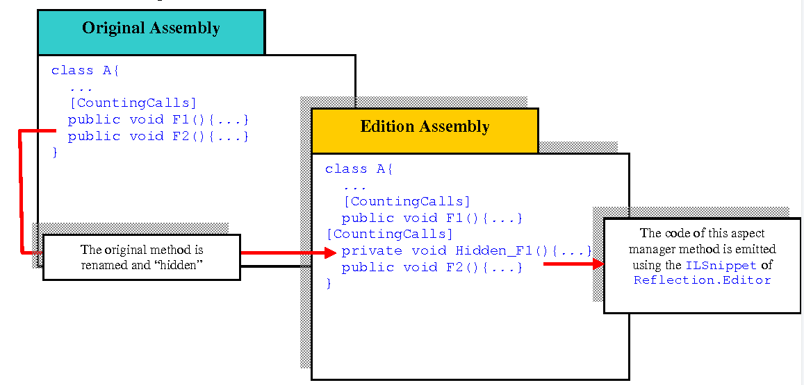

## 什么是面向切面编程

**在计算机领域，面向切面编程(Aspect Oriented Program, AOP)是一种编程范式，旨在通过允许跨领域的关注点分离来提高模块化程度**。它通过向现有的代码添加行为而不修改代码本身，而是通过"指向性(pointcut)"规范单独指定哪些代码被修改，例如 "当函数的名称以'set'开头时，记录所有的函数调用"。**这使得那些不是业务逻辑核心的行为(如日志)可以被添加到程序中，而不会使功能的核心代码变得混乱。**

面向切面编程包括支持源代码层面的关注点模块化的编程方法和工具，而面向切面编程开发是指整个工程学科。

面向切面编程需要将程序逻辑分解成不同的部分(所谓的关注点，功能的凝聚区域)。几乎所有的编程范式都支持某种程度的分组，并通过提供可用于实现、抽象和组合这些关注点的抽象(例如，函数、程序、模块、类、方法)，将关注点封装成独立的实体。**有些关注点"跨越"了程序中的多个抽象，并且违背了这些实现的形式。这些关注点被称为跨领域关注点或水平关注点**。

**日志是跨领域关注的典范，因为一个日志策略必然会影响到系统的每一个日志部分**。因此，日志与所有被记录的类和方法交叉进行。

**所有的AOP实现都有一些交叉表达，将每个关注点封装在一个地方**。实现之间的区别在于所提供的构造的力量、安全性和实用性。例如，指定方法的拦截器可以表达有限形式的交叉切割，但对类型安全或调试没有太多的支持。`AspectJ`有很多这样的表达方式，并将它们封装在一个特殊的类中，即aspect。例如，一个方面可以通过在不同的连接点(程序中的点)应用建议(额外的行为)来改变基础代码的行为(程序中的非方面部分)，这些连接点是由被称为pointcut(检测给定连接点是否匹配)的量化或查询指定的。一个方面也可以对其他类进行二进制兼容的结构改变，比如增加成员或父类。

## 相关文章

* [乘风破浪，遇见最佳跨平台跨终端框架.Net Core/.Net生态 - 浅析ASP.NET Core引入面向切面编程(AOP)的能力和第三方依赖注入框架Autofac](https://www.cnblogs.com/taylorshi/p/16697506.html)